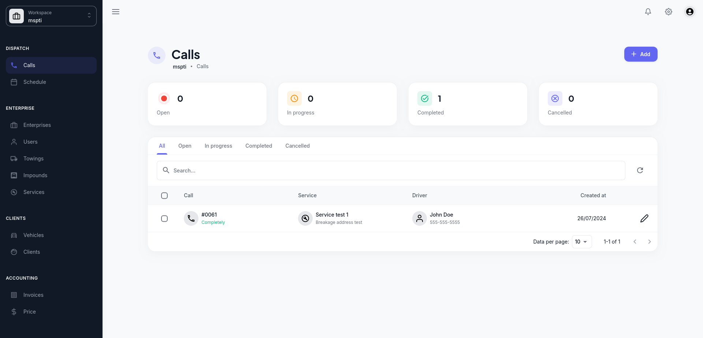

# Dispatch Web App (RQ)

Mono repo containing app/services of RQ - A multitenant towing dispatcher.

## Apps & Services

- `frontend`: Web interface built with [Next.js](https://nextjs.org)
- `socket`: [Socket.io](https://socket.io) server for realtime stuff

## Setup

- `pnpm install --recursive` to install dependencies
- Follow the setup instructions in each app's README.md file, if available

## Development

- `pnpm run dev` to start the development server of all apps and services

## Production Build

- `pnpm run build` to create a production build of all apps and services
- `pnpm run start` to start the production build of all apps and services
